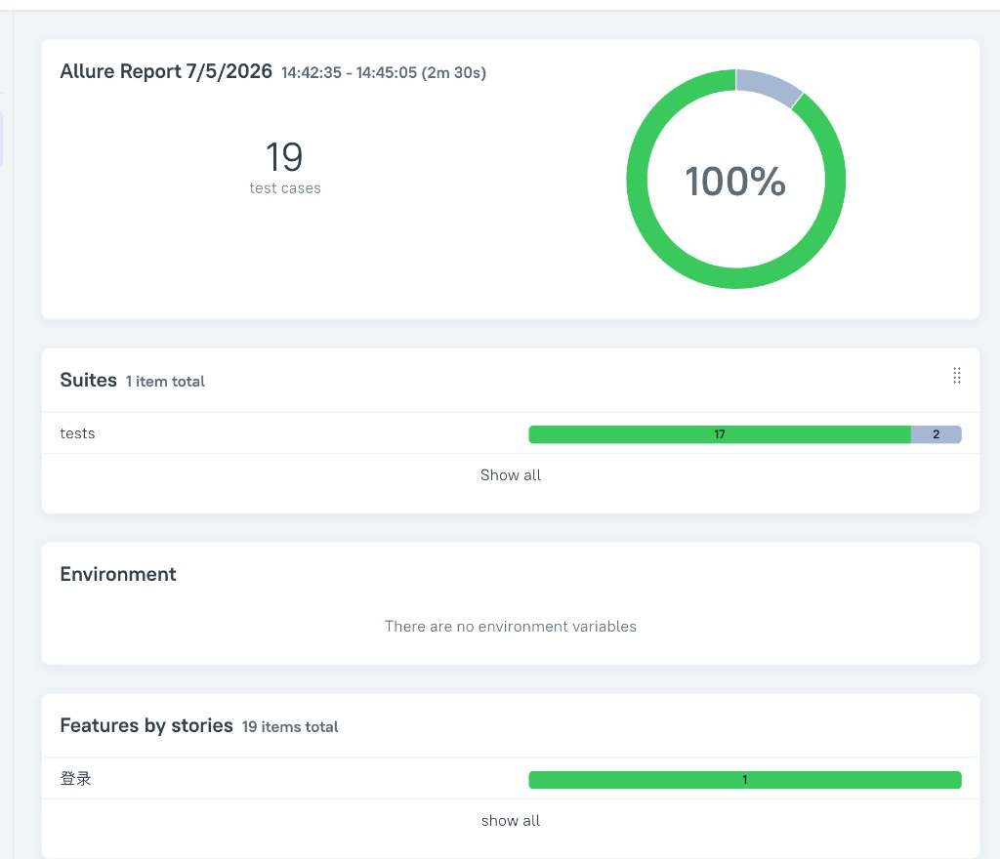
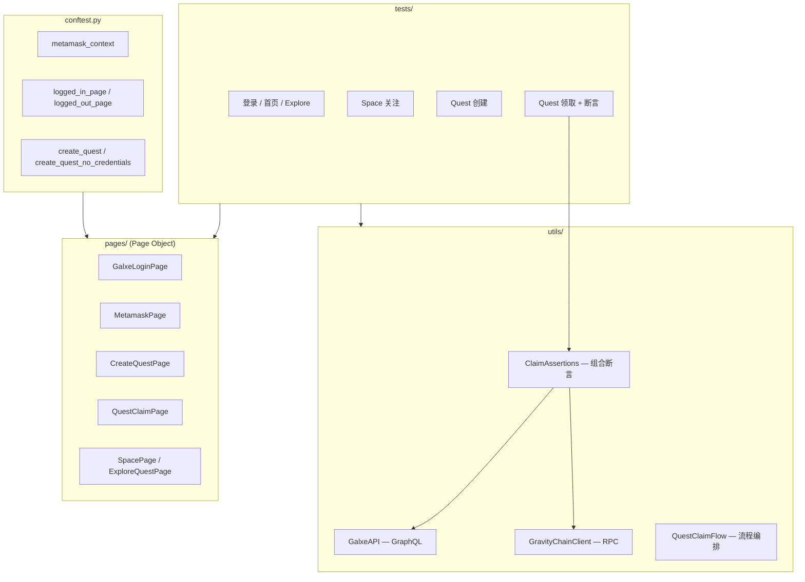

# Galxe Web3 回归自动化测试框架

面向 [Galxe](https://app.stg.galxe.com) Web3 增长平台的端到端（E2E）自动化回归测试项目。覆盖钱包登录、Quest 创建与领取、Space 关注等核心用户路径，并支持 **UI + GraphQL API + 链上交易** 的多层断言，适用于 Web3 产品持续集成与发布前回归验证。

---

## 项目亮点

| 能力 | 说明 |
|------|------|
| **Web3 E2E 自动化** | 通过 Playwright 加载 MetaMask 扩展，自动化 Connect / Sign 弹窗，完成真实 DApp 登录与链上交互 |
| **Page Object 分层** | 页面逻辑与测试用例解耦，便于维护与扩展 |
| **多层断言** | UI 状态 + Galxe GraphQL（`claimedLoyaltyPoints`）+ Gravity 链 RPC 交易解析，交叉验证领取结果 |
| **Fixture 编排** | 统一管理登录态、Quest 创建、MetaMask 钱包初始化等测试前置条件 |
| **Allure 报告** | 步骤级报告、失败自动截图，便于问题定位 |
| **Dry-Run 模式** | 环境不可用时，可用样本数据验证 API / 链上断言逻辑，保证 CI 稳定性 |

---

## Allure 测试报告

全量回归执行后，通过 Allure 生成可视化报告，支持按 Suite / Feature / Story 查看用例分布，失败用例自动附带截图。



| 指标 | 结果 |
|------|------|
| 用例总数 | 19 |
| 通过 | 17 |
| 跳过 | 2（Live Claim，STG 环境限制） |
| 执行耗时 | ~2m 30s |

```bash
pytest --alluredir=allure-results --headed
allure serve allure-results
```

---

## 技术栈

- **语言**：Python 3.12
- **浏览器自动化**：Playwright + pytest-playwright
- **测试框架**：pytest
- **报告**：Allure
- **配置管理**：python-dotenv
- **被测目标**：Galxe STG 环境（`app.stg.galxe.com`）
- **钱包**：MetaMask Chromium Extension（持久化 Profile）

---

## 架构概览



---

## 测试覆盖

### 功能模块

| 模块 | 测试文件 | 覆盖场景 |
|------|----------|----------|
| 登录 | `test_login.py` | MetaMask 钱包登录 / 登出态清理 |
| 首页 | `test_homepage.py` | 首页可访问性 |
| Explore | `test_explore.py` | 首页 → Explore → Quest 详情导航 |
| Space | `test_space.py` | Space 列表、详情、Follow / Unfollow、未登录引导 |
| Quest 创建 | `test_create_quest.py` | 完整创建流程（Info → Points → Task → Release） |
| Quest 领取 | `test_quest_claim.py` | 无 Credential 领取、Dry-Run 全流程 |
| 领取断言 | `test_claim_assertions.py` | GraphQL / 链上 / 组合断言（样本数据，无需浏览器） |

### 核心业务流程

**Quest 创建（`create_quest` fixture）**

1. MetaMask 登录 Galxe
2. 填写 Quest 信息、Points 奖励、Task Group
3. 关闭 Participation Requirement → Release

**Quest 领取 + 验证（`QuestClaimFlow`）**

1. 创建 Private + No Task Requirement 的 Quest
2. UI 完成 Claim，从成功弹窗提取交易 Hash
3. API 断言 `claimedLoyaltyPoints`
4. 链上解析 Gravity 交易 Event，校验 recipient 与 points 数量

---

## 项目结构

```
galxe-web3-regression-automation/
├── conftest.py              # pytest fixtures、失败截图钩子
├── pytest.ini
├── requirements.txt
├── .env.example
│
├── pages/                   # Page Object
│   ├── galxe_login_page.py  # 登录 / 登出
│   ├── metamask_page.py     # 钱包初始化、弹窗批准
│   ├── create_quest_page.py # Quest 创建向导
│   ├── quest_claim_page.py  # Quest 领取
│   ├── space_page.py
│   └── explore_quest_page.py
│
├── tests/
│   ├── test_login.py
│   ├── test_create_quest.py
│   ├── test_quest_claim.py
│   ├── test_claim_assertions.py
│   ├── test_space.py
│   ├── test_explore.py
│   ├── test_homepage.py
│   └── fixtures/
│       └── claim_samples.py # 链上 / API 断言样本数据
│
├── utils/
│   ├── config.py
│   ├── galxe_api.py         # GraphQL 查询
│   ├── gravity_chain.py     # Gravity RPC 交易解析
│   ├── claim_assertions.py  # API + 链上组合断言
│   └── quest_claim_flow.py  # 领取流程编排
│
├── tools/
│   ├── init_metamask.py     # 初始化 MetaMask Profile
│   └── export_metamask_extension.py
│
├── extensions/metamask/     # MetaMask 扩展（需自行导出，见下方说明）
└── profiles/metamask/       # 持久化浏览器 Profile（gitignore）
```

---

## 快速开始

### 环境要求

- macOS / Linux（MetaMask 扩展自动化需 **headed** 模式，不支持 headless）
- Python 3.12+
- [Allure Commandline](https://docs.qameta.io/allure/)（可选，用于查看报告）

### 1. 克隆与安装依赖

```bash
git clone <your-repo-url>
cd galxe-web3-regression-automation

python3 -m venv venv
source venv/bin/activate
pip install -r requirements.txt
playwright install chromium
```

### 2. 配置环境变量

```bash
cp .env.example .env
```

编辑 `.env`，至少配置以下项：

```env
BASE_URL=https://app.stg.galxe.com/

# MetaMask
METAMASK_EXTENSION_PATH=extensions/metamask
METAMASK_PROFILE_PATH=profiles/metamask
METAMASK_MNEMONIC=your twelve word mnemonic here
METAMASK_PASSWORD=your_wallet_password

# 断言（可选，有默认值）
TEST_WALLET_ADDRESS=0xYourWalletAddress
GALXE_GRAPHQL_URL=https://graphigo.stg.galaxy.eco/query
GRAVITY_RPC_URL=https://mainnet-rpc.gravity.xyz/
```

> **安全提示**：`.env`、助记词和 Profile 目录请勿提交到 Git。

### 3. 准备 MetaMask 扩展

将 MetaMask Chromium 扩展解压到 `extensions/metamask/`，或使用项目提供的导出脚本：

```bash
python tools/export_metamask_extension.py
```

首次运行前初始化钱包 Profile：

```bash
python tools/init_metamask.py
```

### 4. 运行测试

```bash
# 全量测试（需 headed + MetaMask）
pytest --headed

# 登录测试
pytest tests/test_login.py -v --headed

# Quest 创建
pytest tests/test_create_quest.py -v --headed

# 断言层测试（无需浏览器，适合 CI）
pytest tests/test_claim_assertions.py tests/test_quest_claim.py -v

# 生成 Allure 报告
pytest --alluredir=allure-results --headed
allure serve allure-results
```

---

## Fixture 说明

| Fixture | 作用 |
|---------|------|
| `metamask_context` | Session 级持久化浏览器上下文，加载 MetaMask 扩展 |
| `page` | 每个用例新建 Galxe 标签页，用例结束自动关闭 |
| `logged_out_page` | 确保 Galxe 处于未登录状态（UI Disconnect + 清 Cookie） |
| `logged_in_page` | 自动 MetaMask 登录，跳过已登录场景 |
| `guest_page` | 无 MetaMask 的干净浏览器，用于未登录交互测试 |
| `create_quest` | 创建带 Visit Credential 的 Quest，返回 `{url, title}` |
| `create_quest_no_credentials` | 创建 Private + 无 Task 的 Quest，用于领取测试 |

---

## 设计说明

### MetaMask 自动化

- 使用 `launch_persistent_context` 持久化 Profile，避免每次用例重新导入助记词
- `MetamaskPage` 封装解锁、Connect、Sign 等弹窗交互，兼容中英文 UI
- 登录测试通过 `logged_out_page` 先 Disconnect，保证用例从干净状态开始

### 多层 Claim 断言

领取成功后，框架会从 UI 弹窗提取 Explorer 链接，并执行：

1. **API 层**：轮询 GraphQL `QuestClaimSection`，校验 `whitelistInfo.claimedLoyaltyPoints`
2. **链上层**：通过 Gravity RPC 获取 receipt，解析 Claim Event（topic + recipient + amount）
3. **组合断言**：`ClaimAssertions.assert_full_claim()` 一次性完成上述校验

### 失败诊断

`conftest.py` 中注册了 `pytest_runtest_makereport` 钩子：用例失败时自动截取全页截图并附加到 Allure 报告。

---

## 简历描述参考

> 独立设计并实现 Galxe Web3 DApp E2E 自动化测试框架（Python + Playwright + pytest）。基于 Page Object 模式封装 6+ 页面组件，通过 MetaMask 扩展自动化完成钱包 Connect/Sign 全流程；设计 GraphQL + 链上 RPC 双层断言体系，交叉验证 Quest 领取结果；使用 pytest Fixture 编排登录态与测试数据，集成 Allure 报告与失败截图，支撑 STG 环境核心用户路径回归。

---

## 后续规划

- [ ] GitHub Actions CI：断言层无浏览器 Job + 定时 E2E Job
- [ ] 环境开关：`ENABLE_LIVE_CLAIM` 控制实战领取用例
- [ ] 多钱包 / 多账号 Profile 支持
- [ ] STG 恢复后启用完整 Live Claim E2E

---

## License

MIT（或按你的实际需要修改）
